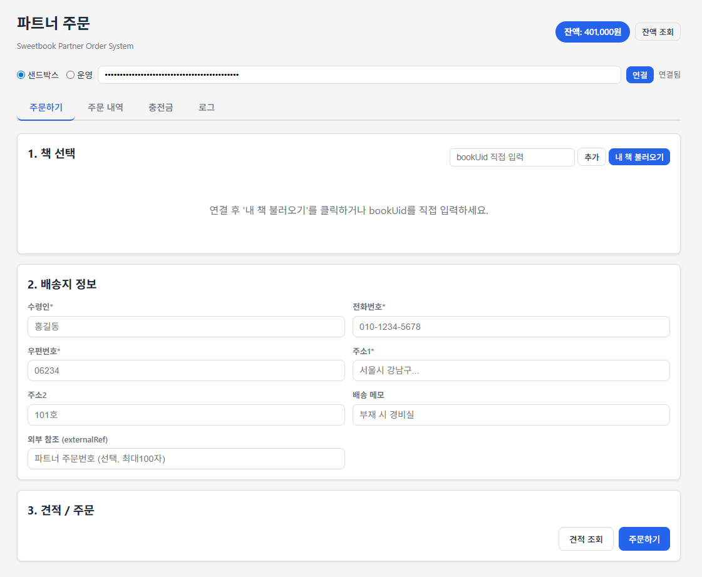

# 파트너 주문 프로그램

Sweetbook API 기반 파트너 주문 웹앱.
파트너사가 생성한 포토북을 단일 또는 묶음으로 주문할 수 있습니다.



> **참고**: 이 프로그램은 파트너사 서버 간 연동의 **프론트엔드 레퍼런스**입니다.
> 실제 서비스에서는 API 키를 서버에서 관리하고, 백그라운드에서 API를 호출하세요.

---

## 빠른 시작

### 1. 설정

```bash
cp config.example.js config.js
```

`config.js`를 열고 환경별 API Key를 입력하세요:

```javascript
const APP_CONFIG = {
    environments: {
        live: { label: '운영', url: 'https://api.sweetbook.com/v1', apiKey: '운영 API Key' },
        sandbox: { label: '샌드박스', url: 'https://api-sandbox.sweetbook.com/v1', apiKey: '샌드박스 API Key' },
    },
    defaultEnv: 'sandbox',
    useCookie: false,
};
```

### 2. 실행

```bash
node server.js                    # http://localhost:8090
```

> Node.js만 필요합니다. npm install 없이 바로 실행됩니다.

### 3. 환경 (샌드박스 / 운영)

- **샌드박스** (기본값): 테스트 환경. 테스트 충전금으로 자유롭게 주문 테스트.
- **운영**: 실제 운영 환경. 운영 API Key가 필요합니다.

> **운영 API Key는 localhost에서 사용할 수 없습니다.**
> 운영 환경에서 주문하려면 API Key 발급 시 등록한 도메인에서 실행해야 합니다.

### 4. Sandbox 테스트

1. 환경을 **샌드박스**로 선택
2. **충전금** 탭에서 테스트 충전금 충전
3. **주문하기** 탭에서 FINALIZED 책을 선택하여 주문 테스트

---

## 기능

### 주문하기
- FINALIZED 책 목록 조회 또는 bookUid 직접 입력
- 여러 책 선택하여 묶음 주문 (items 배열)
- 배송지 입력 + 외부 참조번호(externalRef)
- 견적 조회 (VAT 10% 포함 결제금액 미리 확인)
- 주문 생성 (충전금 즉시 차감)

### 주문 내역
- 상태별 필터 조회
- 주문 상세 (금액, 배송지, 항목별 상태, 송장번호)
- 주문 취소 (PAID / PDF_READY 상태)
- 배송지 변경 (발송 전)

### 충전금
- 잔액 조회
- 거래 내역 (충전, 결제, 취소 반환 등)
- Sandbox 테스트 충전

---

## 주문 흐름

```
1. 책 선택 (FINALIZED 상태)
2. 배송지 입력
3. 견적 조회 (선택)
4. 주문 생성 → 충전금 차감 → 주문번호 발급
```

### 주문 상태

```
PAID(20) → PDF_READY(25) → CONFIRMED(30) → IN_PRODUCTION(40)
  → PRODUCTION_COMPLETE(50) → SHIPPED(60) → DELIVERED(70)

취소: PAID(20) 또는 PDF_READY(25) 상태에서만 가능 → CANCELLED(80/81)
```

| 상태 | 코드 | 설명 | 취소 가능 | 배송지 변경 |
|------|------|------|:---------:|:----------:|
| PAID | 20 | 결제 완료 | O | O |
| PDF_READY | 25 | PDF 생성 완료 | O | O |
| CONFIRMED | 30 | 주문 확정 | X | O |
| IN_PRODUCTION | 40 | 인쇄 중 | X | X |
| PRODUCTION_COMPLETE | 50 | 인쇄 완료 | X | X |
| SHIPPED | 60 | 발송 완료 | X | X |
| DELIVERED | 70 | 배송 완료 | X | X |
| CANCELLED | 80/81 | 취소됨 | - | - |

---

## 가격 계산

```
상품금액 = 단가 × 수량 (파트너 커스텀 가격 적용)
합계     = 상품금액 + 배송비(3,000원)
결제금액 = Floor(합계 × 1.1 / 10) × 10  ← VAT 10% 포함, 10원 미만 절삭
```

### 예시

| 항목 | 금액 |
|------|------|
| 상품금액 (1권) | 8,500원 |
| 배송비 | 3,000원 |
| 소계 | 11,500원 |
| VAT 10% | 1,150원 |
| **결제금액** | **12,650원** → **12,650원** |

> 정확한 금액은 `POST /orders/estimate` API로 사전 확인하세요.

---

## API 엔드포인트 (파트너용)

### 주문

| 메서드 | 경로 | 설명 |
|--------|------|------|
| POST | `/orders/estimate` | 가격 견적 |
| POST | `/orders` | 주문 생성 |
| GET | `/orders` | 주문 목록 |
| GET | `/orders/{orderUid}` | 주문 상세 |
| POST | `/orders/{orderUid}/cancel` | 주문 취소 |
| PATCH | `/orders/{orderUid}/shipping` | 배송지 변경 |

### 충전금

| 메서드 | 경로 | 설명 |
|--------|------|------|
| GET | `/credits` | 충전금 잔액 |
| GET | `/credits/transactions` | 거래 내역 |
| POST | `/credits/sandbox/charge` | Sandbox 테스트 충전 |

### 책 조회

| 메서드 | 경로 | 설명 |
|--------|------|------|
| GET | `/Books` | 책 목록 (status=finalized) |
| GET | `/Books/{bookUid}` | 책 상세 |

---

## SDK 사용 예시

```javascript
// 클라이언트 초기화
const client = new OrderClient({
  apiKey: 'SB_YOUR_API_KEY',
  baseUrl: 'https://api-sandbox.sweetbook.com/v1'
});

// 1. 충전금 잔액 확인
const balance = await client.credits.getBalance();
console.log('잔액:', balance.balance);

// 2. FINALIZED 책 목록
const books = await client.books.list({ status: 'finalized' });
const bookList = books.getList();

// 3. 견적 조회
const estimate = await client.orders.estimate({
  items: [{ bookUid: 'BOOK_UID_HERE', quantity: 1 }]
});
console.log('결제금액:', estimate.paidCreditAmount);

// 4. 주문 생성
const order = await client.orders.create({
  items: [{ bookUid: 'BOOK_UID_HERE', quantity: 1 }],
  shipping: {
    recipientName: '홍길동',
    recipientPhone: '010-1234-5678',
    postalCode: '06100',
    address1: '서울특별시 강남구 테헤란로 123',
    address2: '4층',
    shippingMemo: '부재 시 경비실'
  },
  externalRef: 'MY-ORDER-001'
});
console.log('주문번호:', order.orderUid);

// 5. 주문 취소
await client.orders.cancel(order.orderUid, '테스트 주문 취소');

// 6. 배송지 변경
await client.orders.updateShipping(order.orderUid, {
  recipientPhone: '010-9999-8888',
  shippingMemo: '문 앞에 놓아주세요'
});
```

---

## diaryBook 연동

[diaryBook](../diaryBook)에서 책 생성 → finalize 후 받은 `bookUid`를
이 프로그램의 "bookUid 직접 입력"에 붙여넣거나 "내 책 불러오기"로 조회합니다.

```
diaryBook (localhost:8080)          partner-order (localhost:8090)
책 생성 → finalize → bookUid  ───→  bookUid 입력 → 견적 → 주문
```

---

## 파일 구조

```
partner-order/
├── index.html              # UI (탭: 주문하기, 주문내역, 충전금, 로그)
├── app.js                  # 주문 로직 (UI 이벤트, 주문/충전금 처리)
├── sweetbook-sdk-core.js   # HTTP 클라이언트 베이스 (에러 처리, 요청 파싱)
├── sweetbook-sdk-order.js  # Orders, Credits, Books API 클라이언트
├── server.js               # 로컬 서버 (:8090) + CORS API 프록시
├── config.example.js       # 설정 템플릿 (API Key, 서버 URL)
├── config.js               # 런타임 설정 (git-ignored)
└── style.css               # 스타일
```

---

## 주의사항

- **API Key 보안**: `config.js`는 `.gitignore`에 포함되어 있습니다. 절대 Git에 커밋하지 마세요.
- **Sandbox 환경**: Sandbox에서 생성한 주문은 실제 인쇄/배송되지 않습니다. 테스트 충전금으로 자유롭게 테스트하세요.
- **충전금 차감**: 주문 생성 시 충전금이 즉시 차감됩니다. 주문 취소 시 충전금이 자동 반환됩니다 (별도 환불 API 없음).

> ⚠️ **프로덕션 주의**: `server.js`의 CORS 설정은 `Access-Control-Allow-Origin: *`로 모든 origin을 허용합니다.
> 이는 로컬 개발용이며, 프로덕션 환경에서는 반드시 허용할 origin을 제한하세요.
